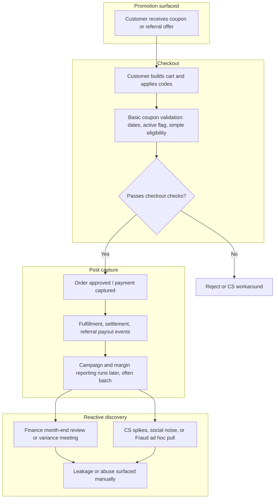

# As-Is Process: Northline Market Promotions and Leakage (Current State)

> **Note:** This is a working as-is for the **PromoLeak Radar** case study. It reflects typical mid-market e-commerce pain, not a audited attestation of Northline Market’s real production flow. Validate steps and system names with stakeholders before you treat any box as gospel.

## Short overview

Today, Northline Market mostly **reacts** to promotion problems after money is already out the door. Coupons and referrals are configured in tools Growth owns, applied at checkout with **light** validation, and reconciled in Finance **later**. There is no standing review queue for suspicious promo activity, no shared definition of “leakage,” and no single owner when stacking or referral rules misbehave.

## Current-state process assumptions

- Customers receive codes through email, SMS, onsite banners, referral links, or partner placements.
- **Basic** validation at checkout checks code exists, dates, and sometimes simple eligibility, but not strong identity or stacking policy against a single source of truth.
- **Campaign reporting** (ROI, discount dollars) is often **batch** and **lagging**, not something Growth watches daily against abuse signals.
- Finance finds margin pressure in **close**; Fraud or nobody runs **ad hoc** queries when a fire starts; CS absorbs customer anger.

---

## As-is flow (Mermaid)

GitHub renders the above as a top-down flow. If the diagram fails in a viewer, check for smart quotes pasted from Word (this file uses straight quotes only).

---

## Step-by-step process explanation

1. **Customer receives coupon** (email, account inbox, referral link, or affiliate). Terms may live in Legal copy, but day-to-day behavior is driven by what Growth configured in the promo admin and commerce catalog.
2. **Customer places order** on web or app, sometimes guest checkout, which weakens “one per person” enforcement if identity is account-only.
3. **Basic coupon validation** runs at cart or checkout: code active, dates, maybe category allow list. **Stacking** and **first-time** rules may not match the written policy if two systems disagree or a recent deploy drifted.
4. **Order is approved** (auth/capture path per Northline’s payment setup). Referral milestones may fire on an event Finance did not intend as “final” for economics.
5. **Campaign reporting** (discount spend, attributed revenue) is refreshed on a **delay**. Growth may look at campaign tool exports; Finance looks at GL and BI after close.
6. **Abuse is discovered manually** when margin misses plan, a Reddit thread blows up, CS tags pile up, or someone in Finance runs a painful spreadsheet join. Response is **incident-by-incident**, not a steady queue with SLAs.

---

## Current pain points

- **No strong duplicate account detection** at checkout time (at best, light checks; easy to farm first-time codes).
- **No coupon stacking control** that matches what Growth thought they published (order of application and legacy quirks).
- **No real-time risk scoring** (batch or nothing; ops flies blind during a runaway code weekend).
- **No review queue** for “this order looks wrong but not illegal”; work lands in inboxes and DMs.
- **No clear owner** for suspicious promotion activity between Marketing, Finance, Fraud, and Product when the ticket could belong to anyone.
- **Campaign ROI** (and leakage) reviewed **too late** to cap a code before most of the damage.
- **Finance and Marketing use different definitions** of leakage (margin after promo vs. promo tool spend vs. attributed net revenue).

---

## Control gaps

| Gap | What goes wrong |
|-----|------------------|
| Weak identity at promo apply | Same person, many accounts, same codes |
| Stacking not enforced to policy | Effective discount blows past intent |
| No referral pattern checks at payout | Self-referral and loops pay out |
| No margin guard on low-SKU promos | Loss leaders go deeper than merchandising allowed |
| No kill-switch discipline | Turning off a code needs heroics |
| Weak audit on who changed a rule | Six months later nobody can reconstruct why |

---

## Where leakage happens (typical)

- **Checkout:** stacking, first-time on wrong identity, category exclusions not applied.
- **Referral service:** payout timing vs. returns, duplicate referee paths.
- **Config / human error:** wrong stack flag, wrong end date, copy-paste campaign.
- **Reporting delay:** dollars leak during the gap between go-live and first serious review.

---

## Stakeholder notes (as-is)

| Stakeholder | What they do today |
|-------------|-------------------|
| **Marketing / Growth** | Publishes codes; often first to hear on social; defensive when Finance blames “the promo” without a shared number. |
| **Finance** | Month-end variance; sometimes builds one-off leakage views; wants a metric they can repeat. |
| **Fraud / Risk** (if staffed) | Pulls lists when asked; no standard SLA tied to promo abuse. |
| **Product / Engineering** | Fixes bugs under pressure; not always looped before Finance escalates externally. |
| **Customer Support** | Credits and apologies; limited visibility into why an account was restricted. |
| **Data / BI** | Ad hoc extracts; tired of “one more cut” without a productized definition. |

---

## Open questions (fill in discovery)

- Exact **order of operations** for multiple discounts on one cart at Northline Market.
- Whether **guest** orders with promos are material to leakage counts.
- **Marketplace** SKUs and whether promo rules even apply the same way.
- Who today has authority to **disable** a code without a full release (often “nobody off-hours”).
