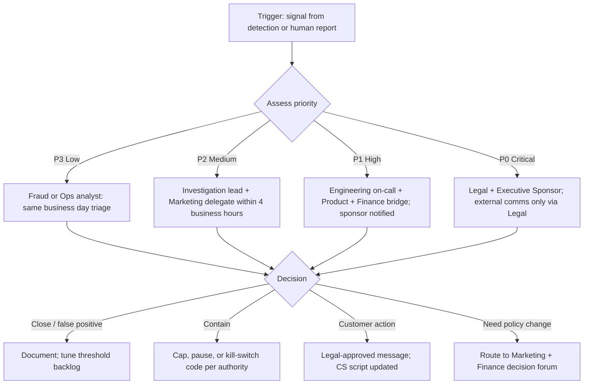

# Escalation Workflow: Suspicious Promotion Cases (Northline Market)

> **Note:** This workflow ties to **PromoLeak Radar** detection signals (duplicate accounts, first-time reuse, referral loops, stacking, low-margin blowouts, redemption spikes, manual overrides). SLAs are **targets** until Operations and the Executive Sponsor sign capacity and on-call coverage.

## Short overview

When the system or a human spots suspicious promotion activity, Northline Market needs a **repeatable** path: who looks first, when to wake someone up, when Legal must be in the room, and what gets written down so Finance and Customer Support are not contradicting each other. This doc is the **case escalation** layer on top of the to-be process, not a replacement for PagerDuty rules in production.

---

## Escalation triggers (non-exhaustive)

Escalation can start from **automation** or **human** intake.

- **Duplicate account signal** (same person, new account pattern).
- **Same payment method across multiple new accounts** in a short window.
- **Same device across multiple accounts** in a short window (where signal exists and Legal approves use).
- **First-time coupon reuse** across linked identities.
- **Referral loop pattern** (self-referral, closed loop, velocity payout abuse).
- **Coupon stacking beyond policy** (effective discount or stack count breach).
- **High discount on low-margin SKU** (margin floor or category exclusion breach).
- **Sudden redemption spike** for a single code or campaign (config error or abuse).
- **Manual override request** that touches promo economics (CS or Marketing asks for an exception that breaks published rules).

---

## Escalation flow (Mermaid)

---

## Case priority levels

| Priority | Meaning (plain English) |
|----------|-------------------------|
| **P3** | Single order or small cluster; no imminent brand blast; routine queue |
| **P2** | Pattern across multiple orders or accounts, or material dollars at risk in 24 to 48 hours |
| **P1** | Widespread misconfiguration or double-discount behavior, or VIP / influencer account |
| **P0** | Legal, regulatory, press, or mass customer harm risk; money moving wrong at large scale |

---

## Case owner by priority

| Priority | Primary owner | Supporting roles |
|----------|---------------|------------------|
| **P3** | Fraud / Risk Analyst or assigned Ops investigator | Data for extracts; Marketing if rule intent unclear |
| **P2** | Investigation lead (Fraud or Ops lead per org pick) | Marketing delegate for code changes; Finance for dollar impact |
| **P1** | Engineering on-call + Product Manager | Finance for freeze vs. revenue trade-off; Marketing for kill-switch authority |
| **P0** | Executive Sponsor + Legal | Marketing and Comms only through Legal-approved channels |

---

## SLA targets (draft, sign in Ops runbook)

| Priority | First human acknowledgment | Containment decision (cap / pause / comms plan started) |
|----------|---------------------------|--------------------------|
| **P3** | Same business day | Within 2 business days unless queued behind P2+ |
| **P2** | Within 4 business hours | Within 1 business day |
| **P1** | Within 1 business hour (business hours) | Within 4 business hours; sponsor join on bridge |
| **P0** | Immediate page to Legal and Sponsor | Per counsel; minutes count for external narrative |

**Off hours:** Northline Market must decide if P1 pages nights and weekends or downgrades to “best effort until 8 a.m.” Document the choice so people do not argue during an incident.

---

## Decision options (reviewer pick list)

- **False positive:** close case, capture reason for tuning.
- **Confirm abuse / policy breach:** apply approved playbook (restriction, clawback, reversal per Legal).
- **Config error, not abuse:** Engineering fix; Marketing owns customer goodwill if any.
- **Ambiguous:** hold with customer-safe messaging until Legal or Marketing clarifies.
- **Escalate priority:** bump to P2 or P1 with written reason (who bumped, why).

---

## Required audit fields (minimum)

Every escalation record should support Finance and Legal questions later.

| Field | Why it matters |
|-------|----------------|
| Case id and linked order ids | Traceability |
| Trigger type(s) | Stacking vs. referral vs. spike |
| Rule and **threshold version** id | Explains why it fired |
| Risk score at time of decision (if used) | Tuning and disputes |
| Owner and timestamps at each status change | SLA proof |
| Decision outcome code + free text | CS and quality analysis |
| Attachments index (screenshots, exports) | Evidence chain per retention policy |
| Customer comms template id used (if any) | Legal defensibility |

---

## Exception handling

- **VIP or press-sensitive** accounts: default path is **P0** even if dollar amount looks small.
- **Marketing emergency override** of a block: requires **second approver** and Legal if customer-visible; logged as manual override (see business rules BR-017 style).
- **Engineering hotfix** rollback: post-incident note must link to a requirement or test gap, even if the gap is “missing monitor.”

---

## Open questions

- Exact dollar or order-count **thresholds** that bump P3 to P2 (Finance + Sponsor).
- Whether **Marketing** alone can invoke kill-switch off-hours or if **Ops** holds the button.
- **CRM** integration: does disposition auto-sync to CS or is paste manual in v1?
- **Retention** for case notes when no law enforcement involvement (Legal).
