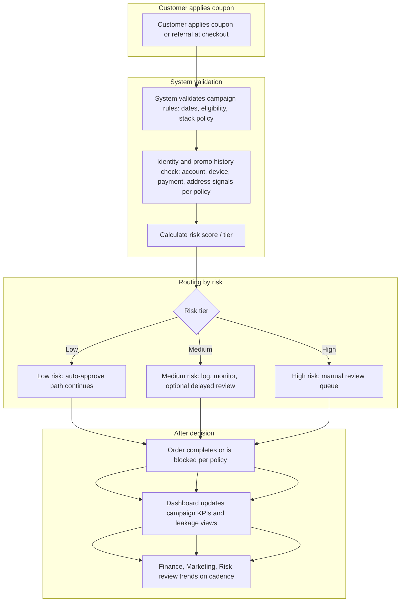

# To-Be Process: Northline Market PromoLeak Radar (Future State)

> **Note:** Future state is **target behavior** for the case study. Engineering may split batch vs. near-time scoring, and Legal must sign any customer-facing enforcement. Treat open questions at the bottom as real homework, not decoration.

## Short overview

Northline Market still runs aggressive promos, but **before** and **after** capture the business applies **consistent** rules, **identity and history checks**, **risk scoring**, and a **manual review path** for high-risk orders. **Marketing**, **Finance**, and **Fraud / Risk** look at the **same** dashboard definitions for campaign KPIs and suspected leakage. Low-risk traffic checks out with minimal friction; high-risk traffic gets a human with tools, SLAs, and an audit trail.

## Future-state design principles

- **Policy and system match:** What Growth publishes is what checkout enforces, versioned and auditable.
- **Don’t boil the ocean in v1:** Batch scoring plus a small queue beats a perfect real-time model that never ships.
- **Named ownership:** Someone is on the hook for queue depth, threshold tuning, and kill-switch decisions.
- **Finance-grade definitions:** Headline metrics have a footnoted spec Finance signed.
- **CS is not last to know:** Customer-visible actions use approved scripts and visible disposition.

---

## To-be flow (Mermaid)

**Reality hook:** “Hold” on high risk may be soft (flag only) in early pilot until Legal approves harder blocks. Call that out in rollout notes, not in the diagram above, or you over-promise.

---

## Step-by-step process explanation

1. **Customer applies coupon** (or referral is in play on the same journey). Same storefront paths as today, but behind the scenes more data is read.
2. **System validates campaign rules** against the **authoritative** rule store for that campaign (not a stale spreadsheet). Stacking order is deterministic.
3. **Identity and promo history checks** run against Northline Market’s agreed definition of “customer” and lookback windows (see `04-business-requirements/business-rules.md`). This is where duplicate accounts and first-time reuse get caught **before** or **right after** capture, depending on architecture.
4. **Risk score** combines signals (stack stress, margin floor breach, referral pattern, velocity). Weights are versioned so Finance can explain month-over-month jumps.
5. **Low risk** orders flow with minimal added latency (exact latency is an NFR spike).
6. **Medium risk** orders complete but are **logged** for monitoring, cohort review, and threshold tuning. Marketing may get a weekly digest, not a page at 2 a.m. for every medium hit.
7. **High risk** orders go to a **manual review queue** with assignment, SLA, and disposition codes. Some paths may **block** capture only if Legal and Product sign that UX.
8. **Dashboard** updates campaign KPIs, flag volume, false positive rate, and leakage proxy metrics Finance owns.
9. **Finance, Marketing, and Risk** review trends on a **weekly** (ops) and **monthly** (exec) cadence from the same definitions.

---

## Key controls added

| Control | Purpose |
|---------|---------|
| Authoritative rule + version id | Stops “we didn’t mean to stack that” drift |
| Identity and history checks | Cuts duplicate and first-time reuse |
| Risk scoring | Prioritizes humans and reduces blind firefighting |
| Manual review queue + SLA | Work is visible, not in Slack threads |
| Dashboard + agreed definitions | One place for Marketing vs. Finance arguments |
| Kill-switch / cap path | Limits blast radius when a code runs hot |
| Audit trail on decisions and config | Defensible when a customer or regulator asks |

---

## Stakeholder handoffs

| From | To | When |
|------|-----|------|
| **Engineering / Data** | **Operations / Fraud** | Pipeline healthy, dashboard date stamp updated |
| **Manual reviewer** | **Customer Support** | Case closed with disposition text agents can read |
| **Marketing** | **All** | Rule or cap change logged with effective time |
| **Finance** | **Marketing + Risk** | Weekly metric review invites with pre-read |
| **Legal** | **Product + CS** | Before new customer-visible enforcement templates go live |

---

## Expected improvements

- **Earlier** detection of runaway campaigns and abusive cohorts (days, not only post-close).
- **Less** revenue loss on low-margin SKUs from unchecked stacking and misconfiguration.
- **Fewer** “mystery” CS credits because disposition and policy line up.
- **Faster** internal alignment when everyone references the same dashboard slice and BRD definitions.

---

## Open questions

- **Hard block vs. flag only** for high risk at v1 (Legal and conversion trade-off).
- **Who owns the queue** org chart name (Fraud vs. Operations vs. hybrid).
- **Marketplace** orders in or out of first release of scoring.
- **Guest checkout** handling when identity is thin.
- **Latency** targets Marketing will accept on checkout if any scoring is synchronous.
