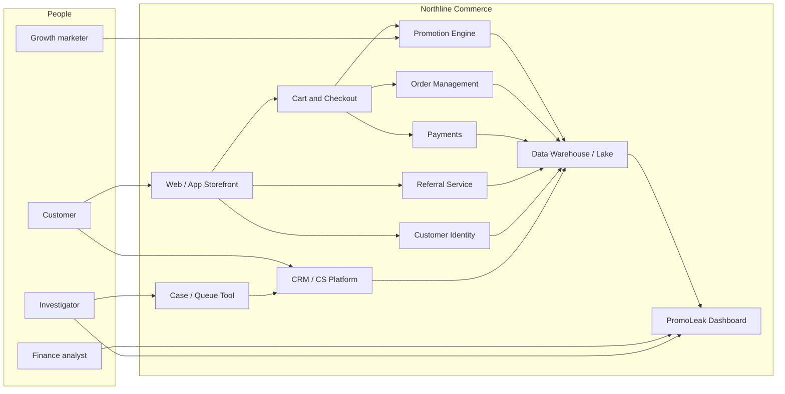

# System Context Diagram (Text / C4 Level 1)

**Note:** Names are generic placeholders. Swap for Northline’s actual systems when doing internal documentation.

## Boundaries

- **In scope for analysis:** data flows needed to compute flags and feed dashboard/case tools.
- **Out of scope (for now):** warehouse management, physical return logistics (except refund events that affect net promo impact).

## Trust boundaries

- PII minimized in Dash per role.
- External SaaS (if any) must meet vendor security review — table TBD.

## Follow-up

- Replace mermaid with official architecture diagram in `assets/diagrams/` when available.
