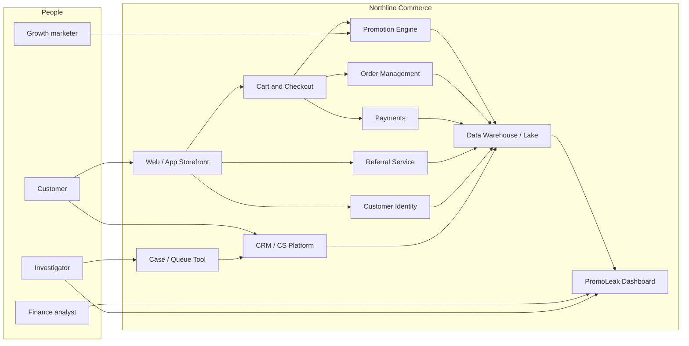

# System Context Diagram (Text / C4 Level 1)

**Note:** Box names are generic; swap in whatever we actually run internally.

## Boundaries

- **In scope for this analysis:** feeds and flows we need to flag orders and feed dashboard + case tool.
- **Out for now:** WMS, physical returns handling — except where refunds change net promo dollars.

- PII minimized on Dash by role.
- Any new SaaS goes through normal vendor security — list TBD.

## Follow-up

Drop a PNG export here when arch review produces something prettier than my mermaid.
