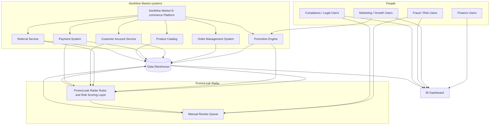

# System Context Diagram: PromoLeak Radar (Northline Market)

**Project:** PromoLeak Radar  
**View:** Context level (who and what talks to what), not internal component design.

PromoLeak Radar sits on top of the existing commerce and promo stack at Northline Market. It reads facts from operational systems and the warehouse, applies rules and risk scoring, feeds a manual review queue, and sends summarized metrics to the BI dashboard Finance, Growth, Fraud, and Legal use.

---

## Mermaid diagram

---

## System interaction notes

- **Shopper path:** Customers interact with the **Northline Market E-commerce Platform**. Checkout calls the **Promotion Engine** for discounts, the **Payment System** for tender, and creates orders in the **Order Management System**. Accounts live in **Customer Account Service**; referrals flow through **Referral Service**; SKU facts come from **Product Catalog**.
- **PromoLeak path:** The **PromoLeak Radar Rules and Risk Scoring Layer** consumes warehouse feeds (and selected near-line feeds where Northline agrees latency targets). It emits flags, scores, and case updates into the **Manual Review Queue**. Investigators work the queue; Growth may still use the native promo admin for authoring, while **kill-switch** style actions must land where checkout honors them (FR-017) with audit (FR-012).
- **Read path for leadership:** **BI Dashboard** reads curated marts in the **Data Warehouse** so Finance and Marketing see aligned campaign and leakage views (FR-006, BR-018). Rule outputs and scores should publish into those marts rather than a one-off path to BI so freshness and security stay centralized. Fraud and Legal may use the same dashboard slices plus the queue UI depending on role (FR-015).

---

## Data handoff notes

| Handoff | What crosses | Owner reminder |
|---------|--------------|----------------|
| OMS and e-commerce to warehouse | Orders, lines, statuses, returns | Operations and Finance agree status definitions |
| Promotion Engine to warehouse | Code metadata, stack policy ids, promotion decisions | Growth owns policy publication |
| Payment System to warehouse | Token or hash surrogates for duplicate logic | PCI and Legal govern fields |
| Referral Service to warehouse | Milestones, payouts, holds, reversals | Finance owns netting rules |
| Rules layer to warehouse | Flags, scores, versions, case ids | Fraud owns threshold meaning |
| Queue to warehouse | Dispositions, assignments, SLA | Ops owns SLA parameters |
| Warehouse to BI Dashboard | Aggregates and limited detail tables | Data Analyst owns mart definitions with Finance |

Freshness and partial loads should surface on dashboards (per dashboard requirements) so nobody trades emails off a stale cut.

---

## Open design questions

- **Latency:** How fast must scoring and kill-switch effects be at checkout vs acceptable batch delay for reporting only? Engineering sets numbers; sponsors pick risk appetite (NFR-001, FR-017).
- **Case tool:** Is the **Manual Review Queue** a new module, an extension of an existing case system, or a bridge to one? RACI and audit still apply either way (FR-012).
- **Embedded vs standalone BI:** Org standard wins; either way role enforcement and export logging stay non-negotiable (FR-014, FR-015).
- **Marketplace orders:** If partner data is thin, leakage and abuse pages need an explicit "excluded" footnote until parity improves (BRD parking lot).
